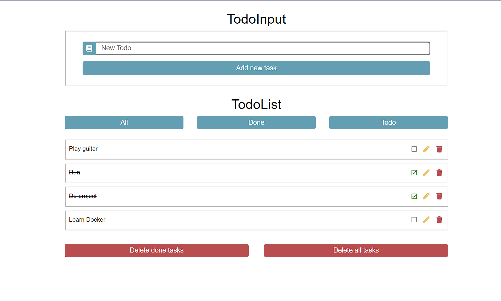

# Todo List Full Stack Development

 
---
* [GitHub]("https://github.com/DilaraSeker/TodoList-FullStackDevelopment")

---
## Description
Todo lists are a list of tasks that an individual needs to complete. In this project you can control your tasks. You can add task, delete task,  mark it as completed etc.

The main purpose of developing the project is to provide full stack development.

---

## Requirements
* Java 19
* Node.js
* IntelliJ IDEA Ultimate
* Visual Studio Code

---

## Visual Studio Codes Extensisons
- Arrow Function Snippets
- Auto Close Tag
- Auto Import
- Auto Rename Tag
- Bootstrap 5 Quick Snippets
- Css Snippet
- Docker
- ES7+ React/Redux/React-Native snippets
- HTML CSS Support
- jQuery Code Snippets
- Live Server
- Material Icon Theme
- Path Intellisense

---

## Tecnology
### FrontEnd
- HTML5
- CSS3
- JavaScript
- React
- JavaScript
- Bootstrap
- Responsive Design

### BackEnd
* Java SE
* Spring Boot
* Spring Core
* Spring Data
* JDBC CRUD Native
* Hibernate

---

## Libraries
* Lombok
* React

## Database
* Mysql

---
## Dependency
* Spring Web
* Spring Data JPA

---

